# Features — MemeBank88 Banking Application

Hexagonal architecture Spring Boot banking service with transfer, fee, and time-restriction capabilities.

---

## Table of Contents

1. [Get Account by ID](#1-get-account-by-id)
2. [Transfer Money Between Accounts](#2-transfer-money-between-accounts)
3. [Fee Policies](#3-fee-policies)
   - [Zero Fee Policy](#31-zero-fee-policy)
   - [Flat Fee Policy](#32-flat-fee-policy)
   - [Variable Fee Policy](#33-variable-fee-policy)
4. [Time-Based Service Availability](#4-time-based-service-availability)
5. [AOP Time Advice (CheckingTimeAdvice)](#5-aop-time-advice-checkingtimeadvice)
6. [Insufficient Funds Guard](#6-insufficient-funds-guard)
7. [Transfer Validation](#7-transfer-validation)

---

## 1. Get Account by ID

Retrieve an account's current balance by its identifier.

**Endpoint**: `GET /account/{id}`

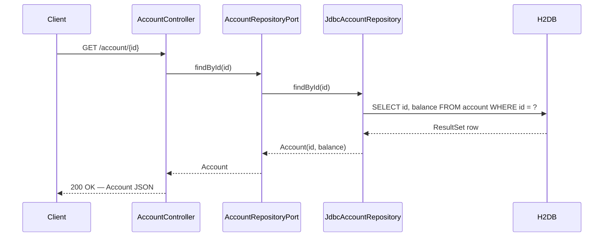

**Error path** — account not found:

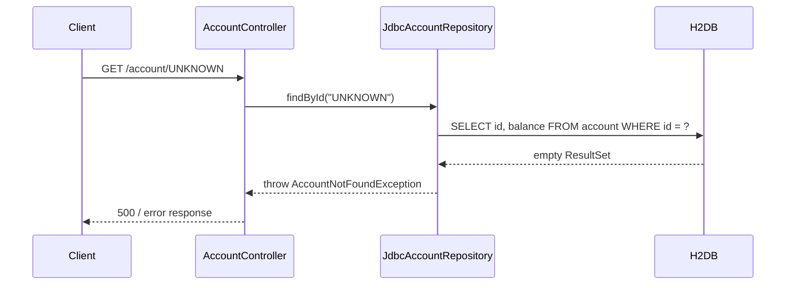

---

## 2. Transfer Money Between Accounts

Core use case: move an amount from a source account to a destination account, optionally charging a fee.

**Endpoint**: `POST /account/{srcId}/transfer/{amount}/to/{destId}`

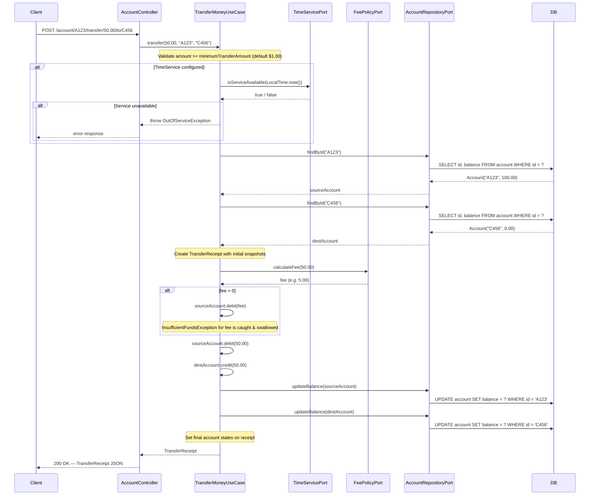

---

## 3. Fee Policies

Fee policies implement the `FeePolicyPort` strategy interface. The active policy is injected into `TransferMoneyUseCase` at construction time.

### 3.1 Zero Fee Policy

No fee is ever charged. Used in basic unit tests and zero-cost transfer scenarios.

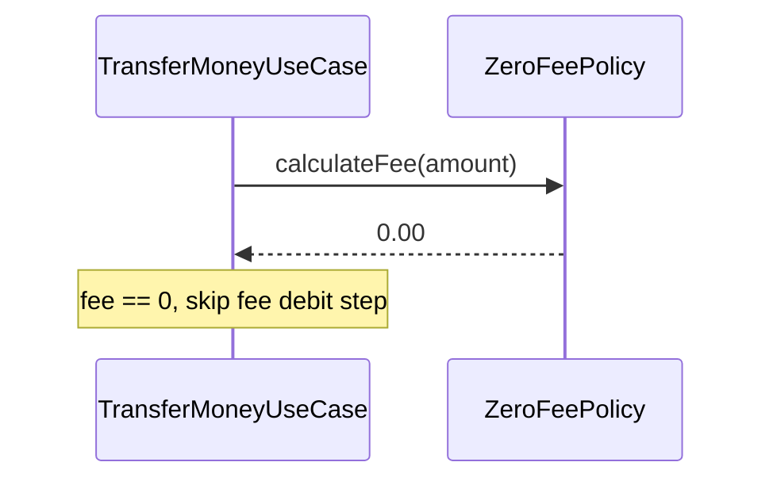

### 3.2 Flat Fee Policy

A fixed dollar amount is charged regardless of transfer size (default: **$5.00**).

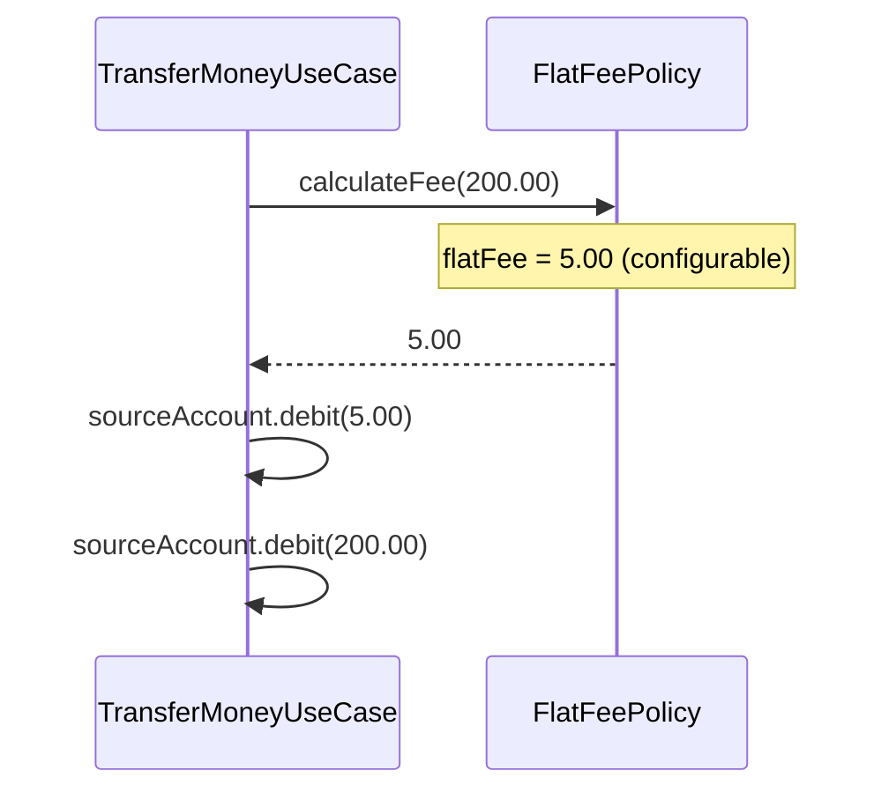

### 3.3 Variable Fee Policy

Tiered fee structure based on transfer amount.

| Tier | Condition | Fee |
|------|-----------|-----|
| Free | `amount <= maxFreeFee` (e.g. ≤ $1,000) | $0.00 |
| Percentage | `maxFreeFee < amount <= maxPercentFee` (e.g. $1,001–$1,000,000) | `amount × percentage / 100` |
| Flat rate | `amount > maxPercentFee` (e.g. > $1,000,000) | `flatRate` (e.g. $20,000) |

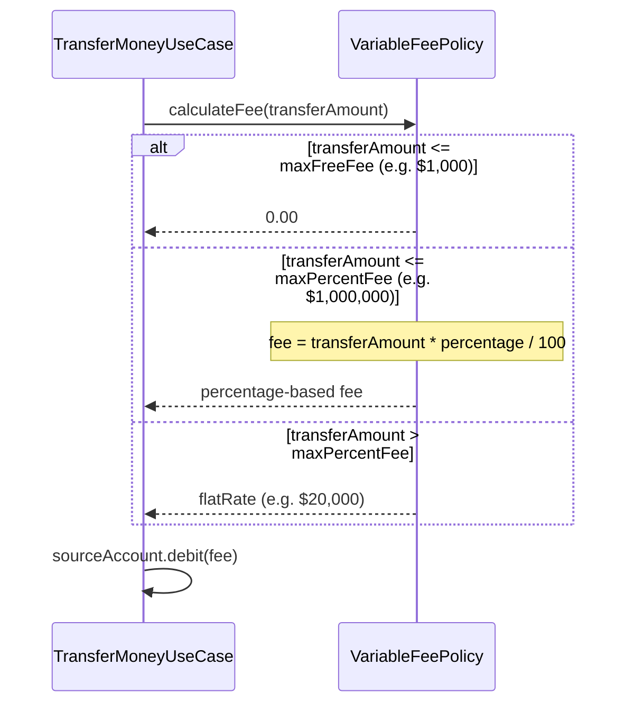

---

## 4. Time-Based Service Availability

`DefaultTimeService` enforces a configurable open/close window. `TransferMoneyUseCase` checks this before executing any transfer when a `TimeServicePort` is wired in.

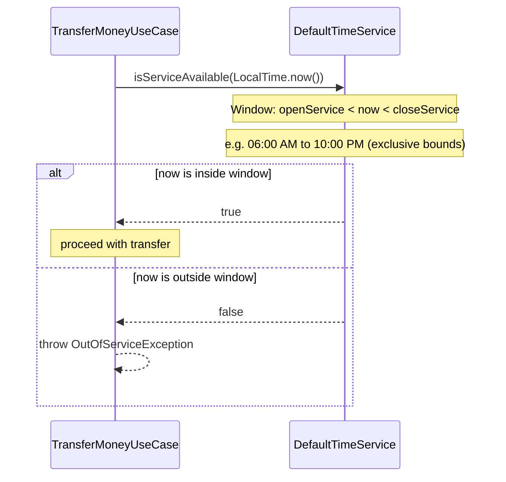

---

## 5. AOP Time Advice (CheckingTimeAdvice)

`CheckingTimeAdvice` implements `MethodInterceptor` and can be applied via Spring AOP proxy to wrap any service method with a time-availability check — decoupled from the service code itself.

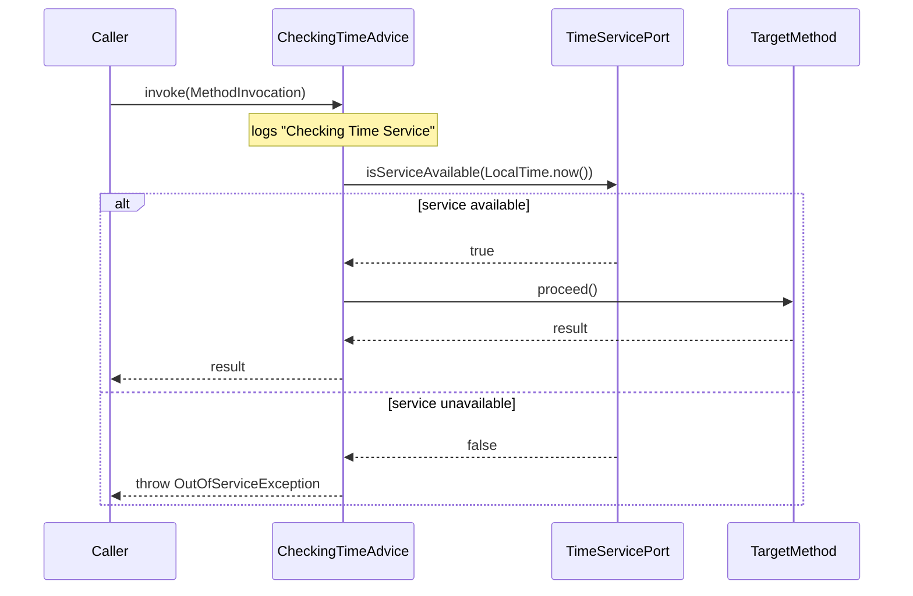

---

## 6. Insufficient Funds Guard

`Account.debit()` enforces that the balance never goes negative. The exception carries full diagnostic detail.

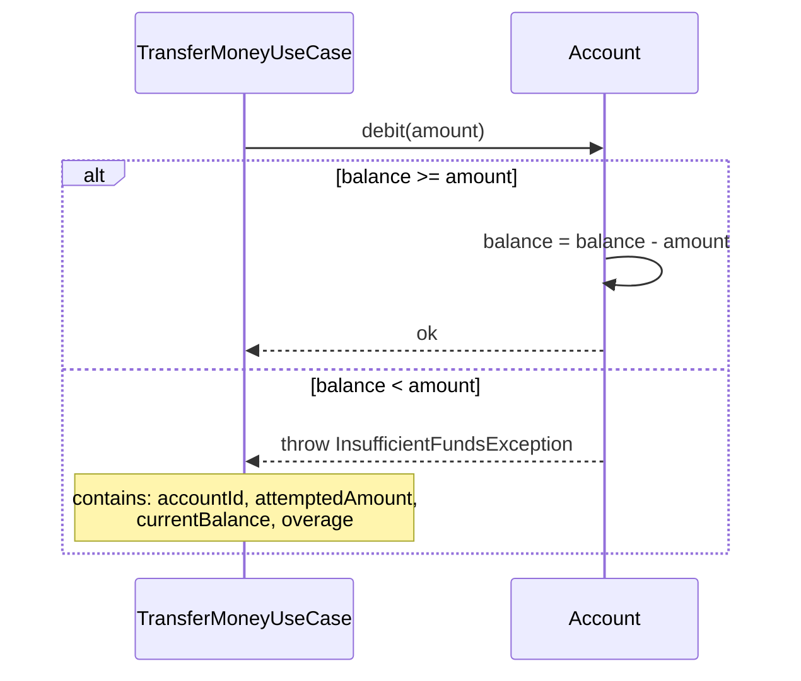

**Fee debit vs. transfer debit behaviour:**

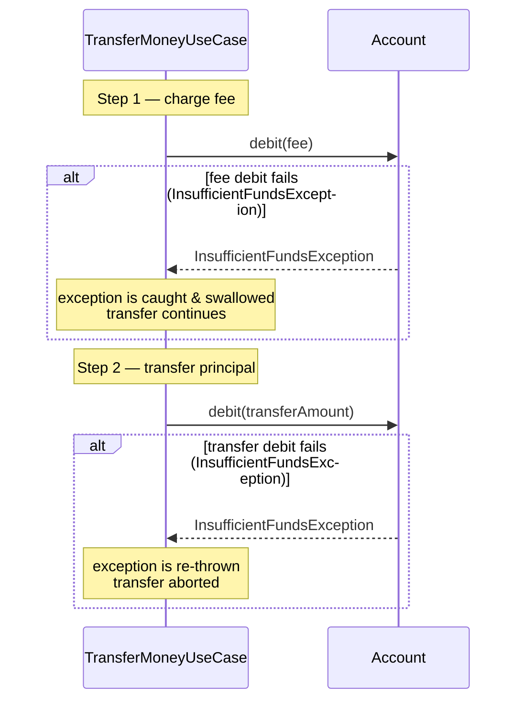

---

## 7. Transfer Validation

`TransferMoneyUseCase` validates the requested amount before touching accounts or the database.

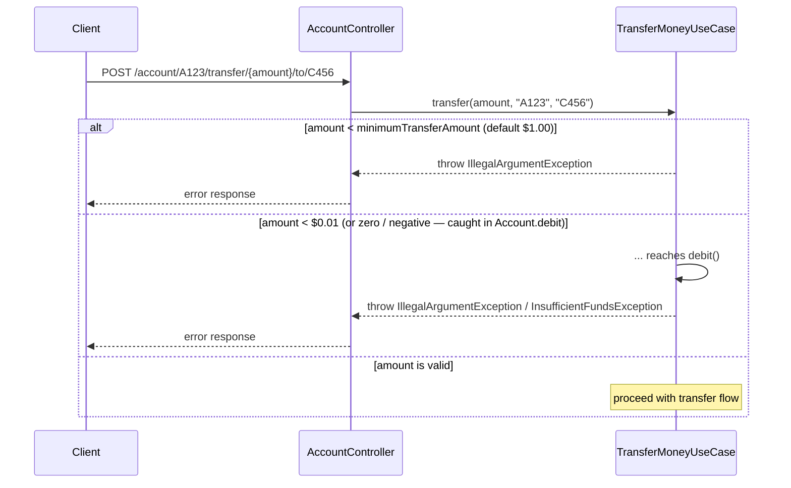

---

## Architecture Overview

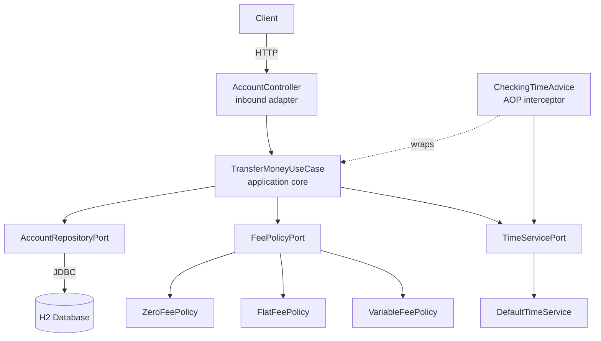
